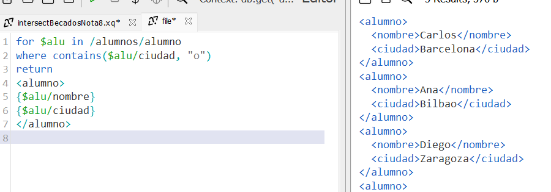

## Ejemplos XQuery básicos

Trabajamos sobre el archivo [alumnos.xml](./alumnos.xml)

### 0 Nombre de todos los alumnos
#### v1
```
for $alu in /alumnos/alumno
return $alu/nombre
```


#### v2 cambiando las etiquetas
```
for $alu in /alumnos/alumno
return <alumno>{$alu/nombre/text()}</alumno>
```


### 2 nombres de los alumnos que tienen beca.
```
for $alu in /alumnos/alumno
where $alu/beca = "Sí"
return $alu/nombre
```


### 3 nombres de los alumnos cuya nota sea mayor que 8.
```
for $alu in /alumnos/alumno
where number($alu/nota) > 8
return $alu/nombre
```


### 4 suma de las notas de todos los alumnos
Es necesario introducir la lista de nodos en una variable `$notas`
```
let $notas :=
for $alu in /alumnos/alumno
return $alu/nota
return sum($notas)
```


#### 4.1 media de las notas
Solo cambiamos la función sum() pot avg()
```
let $notas :=
for $alu in /alumnos/alumno
return $alu/nota
return sum($notas)
```


### 5 Alumnos con una "o" en el nombre de su ciudad
Solo los nombres:
```
for $alu in /alumnos/alumno
where contains($alu/ciudad, "o")
return $alu/nombre/text()
```


Elementos alumno con subelementos nombre y ciudad:
```
for $alu in /alumnos/alumno
where contains($alu/ciudad, "o")
return 
<alumno>
{$alu/nombre}
{$alu/ciudad}
</alumno>
```


### 6 número de alumnos en 2ª DAM
```
let $alumnos :=
for $alu in /alumnos/alumno
where $alu/curso = "2º DAM"
return $alu
return count($alumnos)
```


### 7 nombre y nota de los alumnos dentro de un elemento `<alumno>` ordenados por nota de mayor a menor
```
for $a in /alumnos/alumno
order by number($a/nota) descending
return
<alumno>
{$a/nombre}
{$a/nota}
</alumno>
```


### 8 alumnos organizados dentro de etiquetas `<becados>` y `<no_becados>`, según si tienen beca o no.
##### v1 Etiqueta para cada alumno
```
for $a in /alumnos/alumno
order by $a/beca
return
if ($a/beca = "Sí")
then <becado>{$a/nombre}</becado>
else <noBecado>{$a/nombre}</noBecado>
```


##### v2 Etiqueta general
> atención a la coma que separa los dos elementos `<becados></becados>` y `<no_becados>`

```
    <becados>
    {
    for $a in /alumnos/alumno
    where $a/beca = "Sí"
    return <alumno>{$a/nombre}</alumno>
    }
    </becados>
    ,
    <no_becados>
    {
    for $a in /alumnos/alumno
    where $a/beca = "No"
    return <alumno>{$a/nombre}</alumno>
    }
    </no_becados>
```


### 9 Unión de los alumnos de 1º y 2º

#### usando paréntesis
```
(for $a in /alumnos/alumno
where $a/curso = "1º DAM"
return $a/nombre)
union
(for $a in /alumnos/alumno
where $a/curso = "2º DAM"
return $a/nombre)
```


#### usando variables
```
let $alu1 :=
for $a in /alumnos/alumno
where $a/curso = "1º DAM"
return $a/nombre


let $alu2 :=
for $a in /alumnos/alumno
where $a/curso = "2º DAM"
return $a/nombre

return $alu1 union $alu2
```


### 10 itersección de los alumnos de 1º que tienen beca
```
let $primero :=
for $a in /alumnos/alumno
where $a/curso = "1º DAM"
return $a

let $becados :=
for $a in /alumnos/alumno
where $a/beca = "Sí"
return $a

return $primero intersect $becados
```
